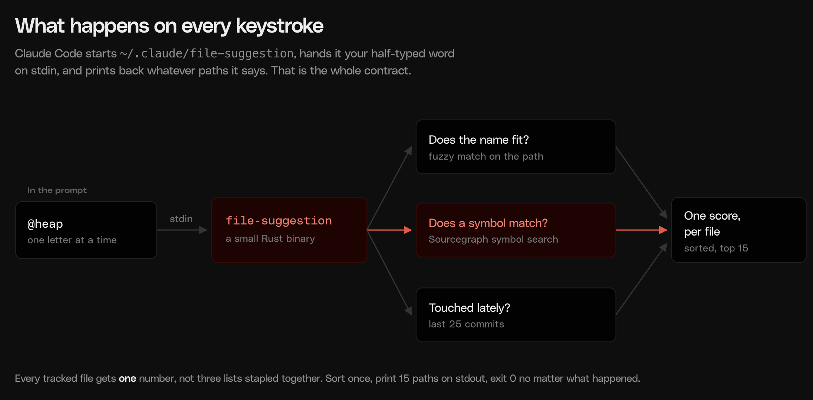

# Symbol-ranked file picker

Replace Claude Code's `@` file picker with one that ranks by symbol, not just by filename, using a Sourcegraph symbol search. Typing `@collect_cycles` gets you `heap.rs`; typing `@resolve_virtual_path` gets you `path_security.rs`. Neither filename contains the query.

Blog post: https://sourcegraph.com/blog/claude-code-file-picker-symbol-ranking

## Prerequisites

- Claude Code.
- Rust. `rust-toolchain.toml` pins this directory to `stable`, so `cargo build` picks the right toolchain without touching your global default.
- A repo that your Sourcegraph instance has indexed. Symbol ranking is the whole point, and it comes from the index. Everything else still works without it.
- Python 3 if you want to run the test harness.

## Quickstart

One line, no clone:

```sh
curl -sL https://github.com/sourcegraph-community/cookbook/archive/refs/heads/main.zip -o cookbook.zip && unzip -qo cookbook.zip 'cookbook-main/symbol-ranked-file-picker/*' 'cookbook-main/LICENSE' && (cd cookbook-main/symbol-ranked-file-picker && env -u RUSTUP_TOOLCHAIN cargo build --release && cp target/release/file-suggestion ~/.claude/file-suggestion)
```

Or clone and build:

```sh
git clone https://github.com/sourcegraph-community/cookbook.git
cd cookbook/symbol-ranked-file-picker
cargo build --release
cp target/release/file-suggestion ~/.claude/file-suggestion
```

Do not pipe `cargo build` into `tail` or `head`. It eats the exit code, and you will happily install a stale binary.

Wire it into `~/.claude/settings.json`:

```json
{
  "fileSuggestion": { "type": "command", "command": "~/.claude/file-suggestion" }
}
```

`fileSuggestion` is a top-level key, not one of the entries under `hooks`.

Restart Claude Code, `cd` into an indexed repo, and type `@` followed by a symbol name.

## What it does

Claude Code exposes a `fileSuggestion` hook: when you type `@` in the prompt, it spawns a command once per keystroke, hands it `{"query": "..."}` on stdin, and shows whatever repo-relative paths that command prints on stdout. This recipe is that command, as a small Rust binary.

Filename fuzzy matching only knows what a file is called. It cannot help when you know the function name but not the file it lives in, which is most of the time in an unfamiliar repo. So this blends three signals into one ranked list (`src/score.rs`):

1. **Filename match.** Fuzzy, via [`nucleo-matcher`](https://docs.rs/nucleo-matcher).
2. **Symbol match.** A Sourcegraph symbol search against the repo you are in, so a query that names a symbol finds the file defining it.
3. **Git recency.** A file touched in the last 25 commits edges out an equally-scored file that was not.

Every tracked path gets one score. Sort once, truncate to 15. An exact basename match (`heap` → `heap.rs`) wins outright and skips the Sourcegraph path entirely.



Because the hook runs on every keystroke, the network is never on the hot path. The binary caches symbol results to disk per 4-character prefix. A cold prefix returns filename-only results immediately and spawns a detached fetch that fills the cache for the *next* keystroke. Warm p95 is ~11ms.

| File | What's in it |
| --- | --- |
| `src/main.rs` | The hook contract: stdin JSON in, paths out, exit 0 always. |
| `src/score.rs` | The blend. Read this one if you only read one. |
| `src/symbols.rs` | Sourcegraph symbol search, prefix caching, rarity demotion. |
| `src/git.rs` | Tracked files, recent files, repo slug, all cached, no subprocess on the hot path. |
| `test_harness.py` | Acceptance harness: ranking, regressions, robustness, latency, security. |

## Try it without installing

The binary is the whole interface, so you can drive it exactly like the hook does:

```sh
cd /path/to/an/indexed/repo
echo '{"query":"collect_cycles"}' | CLAUDE_PROJECT_DIR=$PWD /path/to/file-suggestion
```

The first run on a new 4-character prefix returns filename-only results and warms the cache in the background, by design. Either run it twice or warm the prefix yourself first:

```sh
CLAUDE_PROJECT_DIR=$PWD /path/to/file-suggestion --warm coll
```

## Config

All optional.

| Variable | Effect |
| --- | --- |
| `CLAUDE_PROJECT_DIR` | Project root. Falls back to the process cwd. |
| `CLAUDE_SG_ENDPOINT` | Sourcegraph instance to query. Defaults to `https://sourcegraph.com`. |
| `SRC_ENDPOINT` / `SRC_ACCESS_TOKEN` | Sends `Authorization: token <SRC_ACCESS_TOKEN>` **only** when `SRC_ENDPOINT` equals the endpoint being called. |
| `XDG_CACHE_HOME` | Cache root. Defaults to `~/.cache`. |
| `CLAUDE_FILE_SUGGESTION_DEBUG` | Appends one line per invocation to `<cache_dir>/debug.log`. |

For a private instance, set both:

```sh
export CLAUDE_SG_ENDPOINT="https://sourcegraph.example.com"
export SRC_ENDPOINT="https://sourcegraph.example.com"
export SRC_ACCESS_TOKEN="sgp_..."
```

The double condition on the token is not paranoia. An earlier version of this hook attached `SRC_ACCESS_TOKEN` unconditionally and leaked a private-instance token to `sourcegraph.com`. The token had to be rotated. `symbols::fetch_and_write` now enforces both conditions together. `test_harness.py`'s security section runs a local HTTP server, reads the headers it received, and proves no `Authorization` header reaches a mismatched endpoint.

Cache lives under `${XDG_CACHE_HOME:-~/.cache}/claude-file-suggestion/`: the tracked-file list (invalidated on `.git/index` mtime), the recent-files list (keyed on `HEAD`), the repo slug (invalidated on `.git/config` mtime), and per-prefix symbol results (24h TTL, negative results cached too).

## Two details worth stealing

**Cache on the prefix, not the query.** The symbol search is keyed on the first 4 characters of the query, so typing `dropg`, `dropgu`, `dropgua`, `dropguard` costs one fetch, not four. That prefix goes over the wire raw, not normalized: `py_r` finds 117 symbols, `pyr` finds zero.

**Demote symbols whose name everybody claims.** A symbol match only counts for a full tier when the name is rare. A name claimed by 5 or more tracked files (`string`, `resolve`, `Value`) drops one tier, as does a match inside a prose file like `.md` or `.stderr`, and the two stack. Without this, finishing a common word made ranking *worse* than the prefix before it, because every file claiming the name tied at the same score and `git ls-files` order picked the winner.

## Test harness

```sh
FILE_SUGGESTION_BIN=target/release/file-suggestion \
  python3 test_harness.py /path/to/monty
```

Run against a clone of [pydantic/monty](https://github.com/pydantic/monty), which is what the ranking assertions are written for: 1127 files and dense Rust symbols, which is exactly where filename fuzzy matching falls apart. Without `FILE_SUGGESTION_BIN` it tests the installed hook at `~/.claude/file-suggestion`.

Sections: `ranking` prints each query's actual top 3 rather than a bare pass/fail, `regressions` covers one landmine each, `robustness` asserts exit 0 and no panic on hostile input, `latency` measures real subprocess spawns, `security` is the token-leak test above.

Last run on an M-series Mac against `sourcegraph.com`:

```
warm: p50=8.96ms  p95=10.94ms  (n=200, target p95<15ms)
cold (symbol cache cold, file/recency caches warm): p50=6.81ms  p95=8.82ms
first-ever invocation (pays git ls-files + git log once): 64.02ms
```

The ranking cases assert against symbol names as your Sourcegraph instance has them indexed, so a case can go red because upstream renamed something rather than because ranking broke. `resolve_path` became `resolve_virtual_path` exactly this way.

## Known limitations

- **Macros are invisible.** `defer_drop` is a `macro_rules!` macro and absent from the symbol index, so it will never resolve through the symbol channel.
- **Trait methods have no one home.** `py_repr_fmt` is a `PyTrait` method with ~30 near-identical overrides. Symbol search returns all of them as exact `FUNCTION` matches with nothing distinguishing the trait's default body from an override, so no scoring signal can single out "the" definition. Files implementing it still rank above unrelated noise.
- **Debug log timestamps are UTC.** Matching local time would mean a timezone-database dependency for a line that only appears when you explicitly ask for it.
- **The hook does not install itself.** Editing `settings.json` is yours to do, deliberately.
